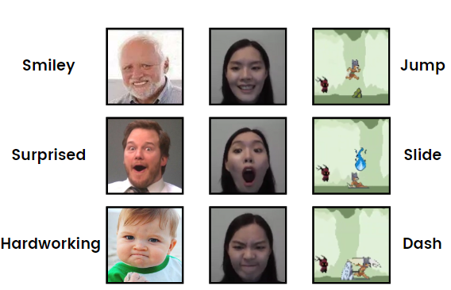

# Expression Parkour Master
> Final Project for CMPT724 Affective Computing

Control parkour action with the user's facial expression. 

## Project Structure

- **parkour.py**: the game with AU detector and DeepFace for expression detection
- **parkour_deepface.py**: the game with DeepFace for expression detection
- **au_model.py**: create our AU detector mode
- **assets**: the directory storing game assets such as background image and sound
- **data**: the directory storing our collected data for self-evaluation, video data are not uploaded to github due to size limit
    - **annotation**: a csv file annotating the expression made at the corresponding time in the video
- **transformer_based_AU_model**: the diectory storing code of training data processing and fine-tuning transformer-based AU detection model, details are explained in [transformer_based_AU_model/README.md](./transformer_based_AU_model/README.md)

### Required Dependencies
- Python
- Pygame
- opencv-python
- tensorflow
- DeepFace
- numpy
- keras-pos-embd
- keras-multi-head
- keras-layer-normalization
- keras-position-wise-feed-forward
- keras-embed-sim
- h5py
- dlib
- imutils
- scikit-learn

You can run `pip install requirements.txt` to install the dependencies.

**Attention!** To run the `parkour.py`, you need to download the fine-tuned weights and place it at `transformer_based_AU_model/models/Transformer_FAU_fold0_newversion.h5`. Please contact the author for the weight file. Or you can run `parkour_deepface.py` to get an idea about what our expression-controlled game looks like. 

## How to play
### Start Game

The game has two mode _NORMAL_ and _CHEAT_. In _CHEAT_ mode, you will not die if hitting an lethal obstacle like Rock and Ghost fire. This is useful to observe the real-time expression detection performance. You can press ⬇️ down key to force game over.

Start game in _NORMAL_ mode with command `python parkour.py`.

Start game in _CHEAT_ mode with command `python parkour.py cmpt724`. 

### Game Control

The game can be controlled either by player's expression or keystroke input.

| Expression | Action Unit | Keystroke | Parkour Action |
|-|-|-|-|
| 😁 Smiley | AU6 Cheek Raiser, AU12 Lip Corner Puller | SPACE | Jump |
| 😲 Surprised | AU2 Outer Brow Raiser, AU 27 Mouth Stretch | LEFT_SHIFT | Slide shovel |
| 😠 Hardworking | AU4 Brow Lowerer, AU5 Upper Lid Raiser, AU7 Lid Tightener, AU23 Lip Tightener   AU9 Nose Wrinkler, AU 15 Lip Corner Depressor, AU 17 Chin Raiser | LEFT_CTRL  | Dash |

The following figure shows the control expressions, sample expressions actually detected by the game, and the controlled action. 

## Self-evaluation

We managed to complete the core tasks written in the proposal. The tasks in our proposal and our final deliverables are listed in the table below:

|Task in Proposal | Deliverable | Completion |
|- |- | -|
| Build an Action Unit detection model | We fine-tuned a transformer-based AU detection model with the DISFA dataset, and combined it with the DeepFace pre-trained emotion detection model for expression detection | Yes |
| Develop a parkour game with Unity or Pygame | We developed the parkour game with Pygame   | Yes |
| Create a dataset us playing the game for evaluation | Created a dataset containing 23 videos of us making expressions to play the game | Yes |
### Explanantion on the use of DeepFace
In addition to our original plan, we added the DeepFace pre-trained model to assist our expression detection. While working on the transformer-based AU detection model, we found it had poor generalization on unseen data (validation accuracy = 0.6), which means our game can never recognize a player's facial action units if the player looks like no one in the training and fine-tuning dataset. At first, we tried to use [Py-Feat](https://py-feat.org/pages/intro.html) to assist our AU detection, but Py-Feat took 5 to 7 seconds to detect the AU in a frame, which made it impossible to run our game in real-time. Therefore, we decided to use the [DeepFace](https://github.com/serengil/deepface) pre-trained emotion detection model to assist our expression detection to improve the generalization. Although the DeepFace model named itself "emotion detection", it actually detects the expressions of the face images and use it for emotion inference because we can never know the people's actual feeling. And we mapped both emotion labels "angry" and "disgust" to our angry(work-hard) control expression, because both expressions have some of the action units seen in a work-hard face.
### Deprecated code from the original implementation of the AU detector
We found that the original transformer-based AU detection model is implemented with Tensorflow 1.15, which is out of support and conflicted with DeepFace. Therefore, we have to re-write some parts to make it runnable under Tensorflow >= 2.9.0. In addition, certain self-defined loss function from the original paper is also deprecated. We tried to contact the author, but we are still waiting for the reply by this time.

## Authors & Contribution
|Authors | Work |
|- | - |
|Ningyi Ke | Game art design & Game model integration & Data collection |
|Yanfei Wang | Game development & Game model integration & Data collection |
|Yiwen Wang | Action Unit Detection model study and fine-tuning & Data collection |

_*All authors contributed equally to the project. Authors are ordered alphabetically by name._
